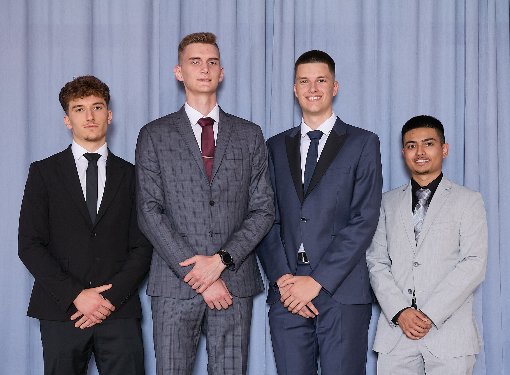

## Hey all! 👋

Meet the people who make DiagNet happen. Our team combines technical expertise,
creativity, and collaboration to bring you the best network testing experience.

---

## Team Members

### Karun – Project Lead

I’m the one steering the ship. I set the technical direction and wear a lot of
hats. Sometimes even all at once. What I spend most of my time on:

- **Crafting the front‑end experience**: building the UI and interactions
- **Designing clean, maintainable code**: writing readable, reusable logic
- **Setting up CI/CD pipelines**: automating builds, tests, and releases
- **Packaging & deploying**: bundling and delivering the final product

Curious about me? Take a look at my [homepage](https://karun.sndh.dev).

### Luka – Scrum Master

My work happens mostly on the backend, where reliability and efficiency matter
most.

I focus on making the system scalable and well-documented, so it can keep up as
the project grows.

That means optimizing the backend, designing APIs, and structuring the database.

I also take care of the practical parts — configuring routers, keeping data
flowing, and running the test pipeline to make sure new features don’t break
what’s already working.

### Benedikt – Developer

I'm one of the driving forces when it comes to the development and design of
our Product.
A few of my most important tasks are:

- Creating an efficient and well structured backend
- Organizing and setting up Soft- and Hardware for testing our Product
- Implementing a seamless interface between our software and the devices it
  tests

Feel free to contact me by writing an
[email](mailto:benedikt.theuretzbachner@htl.rennweg.at).

### Danijel – Developer

I focus on network testing and visualization within the project.
My main responsibilities include:

- Configuring the network topology, especially the switches
- Maintaining test cases for switching
- Implementing the graphical listing and visualization of test results
- Running tests and analyzing their results
- Additionally, I contribute to security hardening and manage our social media
  presence

This way, I make sure the technical foundation is solid and the results are
presented in an accessible way.
